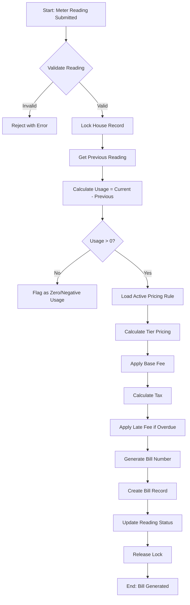

# 💰 Billing Engine Design Document
## Village Water Management System - Financial Grade

---

## 1. Algorithm

### 1.1 Core Billing Calculation Flow



### 1.2 Tier Pricing Algorithm

```typescript
function calculateTierPricing(unitsUsed: number, tiers: Tier[]): number {
    let totalCharge = 0;
    let remainingUnits = unitsUsed;
    
    for (const tier of tiers.sort((a, b) => a.min - b.min)) {
        if (remainingUnits <= 0) break;
        
        const tierCapacity = tier.max 
            ? tier.max - tier.min + 1 
            : remainingUnits;
        
        const unitsInTier = Math.min(remainingUnits, tierCapacity);
        totalCharge += unitsInTier * tier.rate;
        remainingUnits -= unitsInTier;
    }
    
    return totalCharge;
}

// Example Tiers: [
//   { min: 0, max: 10, rate: 10 },    // 0-10 units = 10 THB/unit
//   { min: 11, max: 20, rate: 15 },   // 11-20 units = 15 THB/unit  
//   { min: 21, max: null, rate: 20 }  // 21+ units = 20 THB/unit
// ]
// For 25 units: (10×10) + (10×15) + (5×20) = 100 + 150 + 100 = 350 THB
```

### 1.3 Late Fee Calculation

```typescript
function calculateLateFee(
    baseAmount: number,
    dueDate: Date,
    currentDate: Date,
    penaltyRate: number,  // e.g., 1.5% per month
    maxPenalty: number    // e.g., cap at 30%
): number {
    if (currentDate <= dueDate) return 0;
    
    const monthsOverdue = Math.ceil(
        (currentDate.getTime() - dueDate.getTime()) / (30 * 24 * 60 * 60 * 1000)
    );
    
    const penaltyPercentage = Math.min(monthsOverdue * penaltyRate, maxPenalty);
    return baseAmount * (penaltyPercentage / 100);
}
```

### 1.4 Complete Bill Calculation Algorithm

```typescript
interface BillCalculation {
    waterCharge: Decimal;
    baseFee: Decimal;
    taxAmount: Decimal;
    lateFee: Decimal;
    discount: Decimal;
    totalAmount: Decimal;
}

async function calculateBill(
    reading: MeterReading,
    pricingRule: PricingRule,
    asOfDate: Date = new Date()
): Promise<BillCalculation> {
    // 1. Calculate water usage charge
    const waterCharge = calculateTierPricing(
        Number(reading.unitsUsed),
        pricingRule.tiers as Tier[]
    );
    
    // 2. Base fee
    const baseFee = Number(pricingRule.baseFee);
    
    // 3. Subtotal before tax
    const subtotal = waterCharge + baseFee;
    
    // 4. Tax calculation
    const taxAmount = subtotal * (Number(pricingRule.taxRate) / 100);
    
    // 5. Late fee (if applicable)
    const dueDate = calculateDueDate(reading.billingYear, reading.billingMonth);
    const lateFee = calculateLateFee(
        subtotal + taxAmount,
        dueDate,
        asOfDate,
        1.5,  // 1.5% per month
        30     // Max 30%
    );
    
    // 6. Apply any active discounts
    const discount = await getActiveDiscount(reading.houseId);
    
    // 7. Final total
    const totalAmount = subtotal + taxAmount + lateFee - discount;
    
    return {
        waterCharge: new Decimal(waterCharge),
        baseFee: new Decimal(baseFee),
        taxAmount: new Decimal(taxAmount),
        lateFee: new Decimal(lateFee),
        discount: new Decimal(discount),
        totalAmount: new Decimal(Math.max(0, totalAmount))
    };
}
```

---

## 2. SQL Transaction Flow

### 2.1 Idempotent Bill Generation

```sql
-- ============================================
-- TRANSACTION: Generate Bill with Idempotency
-- ============================================
BEGIN TRANSACTION ISOLATION LEVEL SERIALIZABLE;

-- Step 1: Acquire Advisory Lock on House (prevents double billing)
SELECT pg_advisory_xact_lock(hashtext('house_' || :house_id));

-- Step 2: Verify Reading Exists and Not Billed
SELECT id, status, house_id 
FROM meter_readings 
WHERE id = :reading_id 
  AND is_deleted = false
  AND status != 'BILLED'
FOR UPDATE;

-- Step 3: Check for Existing Bill (Idempotency Check)
SELECT id, status 
FROM bills 
WHERE reading_id = :reading_id 
  AND is_deleted = false
FOR UPDATE;

-- If bill exists and is PAID, abort
-- If bill exists and is not PAID, delete/recalculate

-- Step 4: Lock Pricing Rule
SELECT id, tiers, base_fee, tax_rate 
FROM pricing_rules 
WHERE village_id = :village_id 
  AND is_active = true 
  AND is_deleted = false
FOR SHARE;

-- Step 5: Insert Bill Record
INSERT INTO bills (
    id, house_id, reading_id, pricing_rule_id,
    bill_number, billing_month, billing_year,
    water_charge, base_fee, tax_amount, late_fee,
    discount, total_amount, paid_amount,
    due_date, issued_at, status,
    created_at, updated_at, is_deleted
) VALUES (
    gen_random_uuid(), :house_id, :reading_id, :pricing_rule_id,
    :bill_number, :billing_month, :billing_year,
    :water_charge, :base_fee, :tax_amount, :late_fee,
    :discount, :total_amount, 0,
    :due_date, NOW(), 'UNPAID',
    NOW(), NOW(), false
);

-- Step 6: Update Reading Status
UPDATE meter_readings 
SET status = 'BILLED', updated_at = NOW()
WHERE id = :reading_id;

-- Step 7: Create Audit Log
INSERT INTO activity_logs (
    id, village_id, user_id, action,
    entity_type, entity_id, new_data, created_at
) VALUES (
    gen_random_uuid(), :village_id, :user_id, 'CREATE_BILL',
    'BILL', :bill_id, :bill_data_json, NOW()
);

COMMIT;
```

### 2.2 Payment Processing with Concurrency Control

```sql
-- ============================================
-- TRANSACTION: Process Payment (Idempotent)
-- ============================================
BEGIN TRANSACTION ISOLATION LEVEL SERIALIZABLE;

-- Step 1: Acquire Advisory Lock on Bill
SELECT pg_advisory_xact_lock(hashtext('bill_' || :bill_id));

-- Step 2: Check for Duplicate Transaction (Idempotency)
SELECT id, status 
FROM payments 
WHERE transaction_ref = :transaction_ref 
  AND is_deleted = false;

-- If exists, return existing payment (idempotent)

-- Step 3: Lock Bill Record
SELECT id, total_amount, paid_amount, status
FROM bills 
WHERE id = :bill_id 
  AND is_deleted = false
FOR UPDATE;

-- Step 4: Validate Payment Amount
-- If payment_amount > (total_amount - paid_amount), reject

-- Step 5: Insert Payment Record
INSERT INTO payments (
    id, bill_id, transaction_ref, amount,
    payment_method, payment_date, slip_url,
    is_verified, created_at, updated_at, is_deleted
) VALUES (
    gen_random_uuid(), :bill_id, :transaction_ref, :amount,
    :payment_method, :payment_date, :slip_url,
    :is_verified, NOW(), NOW(), false
);

-- Step 6: Update Bill Status
UPDATE bills 
SET 
    paid_amount = paid_amount + :amount,
    status = CASE 
        WHEN (paid_amount + :amount) >= total_amount THEN 'PAID'
        ELSE 'PARTIAL'
    END,
    updated_at = NOW()
WHERE id = :bill_id;

-- Step 7: Create Audit Log
INSERT INTO activity_logs (...);

COMMIT;
```

### 2.3 Month-End Closing Process

```sql
-- ============================================
-- TRANSACTION: Month-End Closing
-- ============================================
BEGIN TRANSACTION ISOLATION LEVEL SERIALIZABLE;

-- Step 1: Lock All Pending Bills for the Month
SELECT id, house_id, status 
FROM bills 
WHERE billing_year = :year 
  AND billing_month = :month
  AND status IN ('UNPAID', 'PARTIAL')
  AND is_deleted = false
FOR UPDATE;

-- Step 2: Mark Unpaid Bills as OVERDUE
UPDATE bills 
SET 
    status = 'OVERDUE',
    late_fee = calculate_late_fee(total_amount, due_date, NOW()),
    updated_at = NOW()
WHERE billing_year = :year 
  AND billing_month = :month
  AND status = 'UNPAID'
  AND due_date < NOW()
  AND is_deleted = false;

-- Step 3: Create Closing Record
INSERT INTO month_closings (
    id, village_id, year, month,
    closed_at, closed_by, total_bills,
    total_collected, total_outstanding,
    created_at
) VALUES (...);

-- Step 4: Prevent New Readings for Closed Month
-- (Enforced by application logic + trigger)

COMMIT;
```

---

## 3. Locking Strategy

### 3.1 Advisory Locks (Application-Level)

```typescript
// NestJS Service with Advisory Locking
@Injectable()
export class BillingService {
    async generateBillWithLock(readingId: string, userId: string) {
        return this.prisma.$transaction(async (tx) => {
            // 1. Get reading with house info
            const reading = await tx.meterReading.findUnique({
                where: { id: readingId },
                include: { house: true }
            });
            
            // 2. Acquire Advisory Lock on House
            // Prevents concurrent billing for the same house
            await tx.$executeRaw`
                SELECT pg_advisory_xact_lock(hashtext('house_' || ${reading.houseId}))
            `;
            
            // 3. Double-check no bill exists (race condition protection)
            const existingBill = await tx.bill.findUnique({
                where: { readingId }
            });
            
            if (existingBill) {
                throw new ConflictException('Bill already generated');
            }
            
            // 4. Proceed with bill generation
            return this.createBill(tx, reading, userId);
        }, {
            isolationLevel: Prisma.TransactionIsolationLevel.Serializable,
            maxWait: 5000,  // Wait up to 5s for lock
            timeout: 10000  // Transaction timeout 10s
        });
    }
}
```

### 3.2 Row-Level Locking (Database-Level)

```typescript
// Pessimistic Locking Strategy
async function processPayment(billId: string, paymentData: PaymentDto) {
    return this.prisma.$transaction(async (tx) => {
        // FOR UPDATE: Exclusive lock on bill row
        const bill = await tx.$queryRaw<Bill[]>`
            SELECT * FROM bills 
            WHERE id = ${billId} 
            AND is_deleted = false
            FOR UPDATE
        `;
        
        // FOR SHARE: Shared lock on pricing (allows reads, blocks writes)
        const pricing = await tx.$queryRaw<PricingRule[]>`
            SELECT * FROM pricing_rules 
            WHERE id = ${bill[0].pricingRuleId}
            FOR SHARE
        `;
        
        // Process payment with guaranteed consistency
        return this.applyPayment(tx, bill[0], paymentData);
    });
}
```

### 3.3 Optimistic Locking (Version-Based)

```sql
-- Add version column for optimistic locking
ALTER TABLE bills ADD COLUMN version INTEGER DEFAULT 0;

-- Update with version check
UPDATE bills 
SET 
    paid_amount = paid_amount + :amount,
    status = :new_status,
    version = version + 1,
    updated_at = NOW()
WHERE id = :bill_id 
  AND version = :expected_version
  AND is_deleted = false;

-- If no rows updated, throw OptimisticLockException
```

### 3.4 Lock Hierarchy

```
┌─────────────────────────────────────────────┐
│           Lock Priority Order               │
├─────────────────────────────────────────────┤
│ 1. Village Lock (Month-End Closing)        │
│    └─ pg_advisory_lock('village_' + id)    │
│                                             │
│ 2. House Lock (Bill Generation)            │
│    └─ pg_advisory_xact_lock('house_' + id) │
│                                             │
│ 3. Bill Lock (Payment Processing)          │
│    └─ SELECT ... FOR UPDATE                │
│                                             │
│ 4. Pricing Rule Lock (Shared)              │
│    └─ SELECT ... FOR SHARE                 │
└─────────────────────────────────────────────┘
```

---

## 4. Edge Cases

### 4.1 Double Billing Prevention

```typescript
// Strategy 1: Database Unique Constraint
// readingId in bills table has UNIQUE constraint

// Strategy 2: Application-Level Idempotency Key
async function generateBill(readingId: string, idempotencyKey: string) {
    // Store idempotency key in cache/DB with TTL
    const existing = await this.idempotencyStore.get(idempotencyKey);
    if (existing) {
        return existing.result; // Return cached result
    }
    
    // Process and store result
    const result = await this.createBill(readingId);
    await this.idempotencyStore.set(idempotencyKey, result, 3600);
    return result;
}

// Strategy 3: Distributed Lock (Redis)
async function generateBillWithDistributedLock(readingId: string) {
    const lockKey = `bill_gen:${readingId}`;
    const lock = await this.redisLock.acquire(lockKey, 10000);
    
    try {
        return await this.createBill(readingId);
    } finally {
        await lock.release();
    }
}
```

### 4.2 Concurrent Payment Handling

```typescript
// Handle race condition where two payments come in simultaneously
async function processPayment(billId: string, payment: PaymentDto) {
    return this.prisma.$transaction(async (tx) => {
        // Lock bill first
        const bill = await tx.bill.findUnique({
            where: { id: billId },
            select: { totalAmount: true, paidAmount: true }
        });
        
        const remainingAmount = bill.totalAmount - bill.paidAmount;
        
        // Validate payment doesn't exceed remaining
        if (payment.amount > remainingAmount) {
            throw new PaymentExceedsRemainingError();
        }
        
        // Create payment
        await tx.payment.create({ data: payment });
        
        // Update bill atomically
        await tx.bill.update({
            where: { id: billId },
            data: {
                paidAmount: { increment: payment.amount },
                status: payment.amount >= remainingAmount ? 'PAID' : 'PARTIAL'
            }
        });
    }, { isolationLevel: 'Serializable' });
}
```

### 4.3 Negative/Zero Usage Handling

```typescript
function validateReading(reading: MeterReading): ValidationResult {
    const usage = Number(reading.currentReading) - Number(reading.previousReading);
    
    if (usage < 0) {
        // Possible meter rollback or data entry error
        return {
            valid: false,
            code: 'NEGATIVE_USAGE',
            message: 'Current reading is less than previous reading',
            action: 'REQUIRE_ADMIN_APPROVAL'
        };
    }
    
    if (usage === 0) {
        // Valid case: No water usage
        return {
            valid: true,
            code: 'ZERO_USAGE',
            message: 'No water usage recorded',
            action: 'GENERATE_MINIMUM_BILL' // Still bill the base fee
        };
    }
    
    if (usage > 10000) {
        // Suspiciously high usage
        return {
            valid: false,
            code: 'SUSPICIOUS_USAGE',
            message: 'Usage exceeds 10,000 units',
            action: 'REQUIRE_VERIFICATION'
        };
    }
    
    return { valid: true, code: 'VALID' };
}
```

### 4.4 Pricing Rule Changes Mid-Period

```typescript
// Snapshot pricing rule at bill generation time
async function createBill(reading: MeterReading) {
    // Fetch active pricing rule
    const pricingRule = await this.pricingRepo.findActiveForVillage(
        reading.house.villageId
    );
    
    // Store snapshot of pricing data with the bill
    // This ensures historical bills remain accurate even if pricing changes
    return this.billRepo.create({
        ...billData,
        pricingRuleId: pricingRule.id,
        pricingSnapshot: {
            baseFee: pricingRule.baseFee,
            taxRate: pricingRule.taxRate,
            tiers: pricingRule.tiers,
            effectiveDate: pricingRule.effectiveDate
        }
    });
}
```

### 4.5 Partial Payments and Refunds

```typescript
interface PaymentAllocation {
    principal: Decimal;
    lateFee: Decimal;
    tax: Decimal;
}

function allocatePayment(
    paymentAmount: Decimal,
    bill: Bill
): PaymentAllocation {
    // Allocation order: Late Fee -> Tax -> Principal
    const lateFeePayment = Decimal.min(paymentAmount, bill.lateFee);
    const remainingAfterLate = paymentAmount.minus(lateFeePayment);
    
    const taxPayment = Decimal.min(remainingAfterLate, bill.taxAmount);
    const remainingAfterTax = remainingAfterLate.minus(taxPayment);
    
    const principalPayment = remainingAfterTax;
    
    return {
        lateFee: lateFeePayment,
        tax: taxPayment,
        principal: principalPayment
    };
}
```

---

## 5. Protection Against Retroactive Changes

### 5.1 Immutable Bill Records

```sql
-- Trigger to prevent updates to paid/cancelled bills
CREATE OR REPLACE FUNCTION prevent_bill_modification()
RETURNS TRIGGER AS $$
BEGIN
    -- Allow updates only if bill is still UNPAID/PARTIAL
    IF OLD.status IN ('PAID', 'CANCELLED') THEN
        RAISE EXCEPTION 'Cannot modify % bill. Create adjustment instead.', OLD.status;
    END IF;
    
    -- Prevent changes to financial fields
    IF OLD.water_charge != NEW.water_charge OR
       OLD.total_amount != NEW.total_amount OR
       OLD.tax_amount != NEW.tax_amount THEN
        RAISE EXCEPTION 'Financial fields are immutable. Use admin override with audit.';
    END IF;
    
    RETURN NEW;
END;
$$ LANGUAGE plpgsql;

CREATE TRIGGER bill_immutable_fields
    BEFORE UPDATE ON bills
    FOR EACH ROW
    EXECUTE FUNCTION prevent_bill_modification();
```

### 5.2 Admin Override with Audit Trail

```typescript
@Injectable()
export class AdminBillingService {
    async adminOverrideBill(
        billId: string,
        overrideData: AdminOverrideDto,
        adminUser: User
    ) {
        return this.prisma.$transaction(async (tx) => {
            // 1. Get original bill
            const originalBill = await tx.bill.findUnique({
                where: { id: billId }
            });
            
            // 2. Create adjustment record
            const adjustment = await tx.billAdjustment.create({
                data: {
                    billId,
                    adjustedBy: adminUser.id,
                    reason: overrideData.reason,
                    originalData: originalBill,
                    newData: overrideData.changes,
                    approvedBy: overrideData.requiresApproval ? null : adminUser.id
                }
            });
            
            // 3. Apply changes to bill
            const updatedBill = await tx.bill.update({
                where: { id: billId },
                data: {
                    ...overrideData.changes,
                    adjustedAt: new Date(),
                    adjustmentId: adjustment.id
                }
            });
            
            // 4. Comprehensive audit log
            await tx.activityLog.create({
                data: {
                    action: 'ADMIN_BILL_OVERRIDE',
                    entityType: 'BILL',
                    entityId: billId,
                    userId: adminUser.id,
                    oldData: originalBill,
                    newData: updatedBill,
                    metadata: {
                        adjustmentId: adjustment.id,
                        reason: overrideData.reason,
                        adminLevel: adminUser.role
                    }
                }
            });
            
            // 5. Notify affected parties
            await this.notificationService.notifyBillAdjustment(
                originalBill.houseId,
                adjustment
            );
            
            return updatedBill;
        });
    }
}
```

### 5.3 Reading Correction Workflow

```typescript
// When a meter reading needs correction
async function correctReading(
    readingId: string,
    newCurrentReading: Decimal,
    reason: string,
    adminUser: User
) {
    return this.prisma.$transaction(async (tx) => {
        // 1. Get original reading
        const originalReading = await tx.meterReading.findUnique({
            where: { id: readingId },
            include: { bill: true }
        });
        
        // 2. Void existing bill if exists
        if (originalReading.bill) {
            await tx.bill.update({
                where: { id: originalReading.bill.id },
                data: {
                    status: 'CANCELLED',
                    cancelledAt: new Date(),
                    cancellationReason: 'Reading corrected'
                }
            });
        }
        
        // 3. Create correction record
        await tx.readingCorrection.create({
            data: {
                originalReadingId: readingId,
                previousValue: originalReading.currentReading,
                newValue: newCurrentReading,
                correctedBy: adminUser.id,
                reason
            }
        });
        
        // 4. Update reading
        const correctedReading = await tx.meterReading.update({
            where: { id: readingId },
            data: {
                currentReading: newCurrentReading,
                unitsUsed: newCurrentReading.minus(originalReading.previousReading),
                status: 'VERIFIED',
                correctedAt: new Date()
            }
        });
        
        // 5. Regenerate bill
        return this.generateBill(correctedReading.id, adminUser.id);
    });
}
```

### 5.4 Month Closing Protection

```sql
-- Table to track closed months
CREATE TABLE month_closings (
    id UUID PRIMARY KEY DEFAULT gen_random_uuid(),
    village_id UUID NOT NULL REFERENCES villages(id),
    year INTEGER NOT NULL,
    month INTEGER NOT NULL CHECK (month BETWEEN 1 AND 12),
    closed_at TIMESTAMP NOT NULL DEFAULT NOW(),
    closed_by UUID NOT NULL REFERENCES users(id),
    reopened_at TIMESTAMP,
    reopened_by UUID REFERENCES users(id),
    reopen_reason TEXT,
    UNIQUE(village_id, year, month)
);

-- Trigger to prevent modifications to closed periods
CREATE OR REPLACE FUNCTION prevent_closed_period_modification()
RETURNS TRIGGER AS $$
DECLARE
    month_closed BOOLEAN;
BEGIN
    SELECT EXISTS (
        SELECT 1 FROM month_closings 
        WHERE village_id = NEW.village_id
          AND year = NEW.billing_year
          AND month = NEW.billing_month
          AND reopened_at IS NULL
    ) INTO month_closed;
    
    IF month_closed THEN
        RAISE EXCEPTION 'Cannot modify closed billing period %-%', NEW.billing_year, NEW.billing_month;
    END IF;
    
    RETURN NEW;
END;
$$ LANGUAGE plpgsql;

CREATE TRIGGER prevent_closed_period
    BEFORE INSERT OR UPDATE ON bills
    FOR EACH ROW
    EXECUTE FUNCTION prevent_closed_period_modification();
```

---

## 6. Summary Checklist

| Requirement | Implementation |
|-------------|----------------|
| ✅ Usage = Current - Previous | Algorithm validates calculation |
| ✅ Tier Pricing | JSON tiers with step calculation |
| ✅ Late Payment Penalty | Configurable rate with monthly cap |
| ✅ Double Billing Prevention | Unique constraint + advisory locks |
| ✅ Idempotent API | Idempotency keys + distributed locks |
| ✅ Month Closing Mechanism | month_closings table with triggers |
| ✅ Admin Override with Audit | Bill adjustment records + activity logs |
| ✅ Database Transaction | Serializable isolation + row locking |

---

## 7. Implementation Files

### 7.1 Service Layer

```
backend/src/modules/billing/
├── billing-engine.service.ts      # Core billing engine with Tier Pricing, Late Fee
├── month-closing.service.ts       # Month closing mechanism
├── admin-billing.service.ts       # Admin override with audit
├── billing.service.ts             # Legacy billing service
├── billing.repository.ts          # Data access layer
└── billing.module.ts              # Module configuration
```

### 7.2 Database Schema Changes

#### New Tables:
- `bill_adjustments` - Audit trail for admin bill modifications
- `month_closings` - Closed billing periods tracking
- `reading_corrections` - Meter reading correction history

#### Modified Tables:
- `bills` - Added: `late_fee`, `cancelled_at`, `cancelled_by`, `cancellation_reason`, `version`

### 7.3 Database Triggers

#### Bill Immutability Trigger
```sql
-- Prevents modification of paid/cancelled bills
-- Prevents changes to financial fields without admin override
-- Implements optimistic locking via version increment
```

#### Closed Period Protection
```sql
-- Prevents modifications to closed billing periods
-- Enforced at database level
```

### 7.4 Key Algorithms

#### Tier Pricing Algorithm
```typescript
calculateTierPricing(unitsUsed: number, tiers: PricingTier[]): number {
    // Sort tiers by min value
    // Calculate charge for each tier level
    // Return total charge
}
```

#### Late Fee Algorithm
```typescript
calculateLateFee(baseAmount: number, dueDate: Date, currentDate: Date): number {
    // 1.5% per month
    // Max 30% cap
    // Round up months
}
```

### 7.5 Locking Strategy

1. **Advisory Locks** - Application-level locking using PostgreSQL advisory locks
2. **Row-Level Locking** - `FOR UPDATE` for exclusive access
3. **Optimistic Locking** - Version-based concurrency control

### 7.6 Edge Cases Handled

| Edge Case | Handling |
|-----------|----------|
| Negative Usage | Rejected, requires admin approval |
| Zero Usage | Valid, minimum bill (base fee only) |
| Suspicious Usage (>10000) | Flagged for verification |
| Concurrent Payments | Serializable isolation prevents double payment |
| Pricing Rule Changes | Snapshot stored at bill generation |
| Month Closing | Prevents retroactive modifications |

---

## 8. API Endpoints (Recommended)

### Billing Engine
```
POST /bills/generate/:readingId        # Generate bill with idempotency
POST /bills/:id/pay                    # Process payment with idempotency
POST /bills/recalculate-late-fees      # Bulk late fee recalculation
```

### Month Closing
```
POST /billing/month-close              # Close billing month
POST /billing/month-reopen/:id         # Reopen closed month
GET  /billing/month-status             # Check month status
GET  /billing/financial-summary        # Get financial report
```

### Admin Operations
```
POST /admin/bills/:id/override         # Admin override bill
POST /admin/bills/:id/cancel           # Cancel bill
POST /admin/readings/:id/correct       # Correct reading
POST /admin/adjustments/:id/approve    # Approve adjustment
GET  /admin/bills/:id/adjustments      # Get adjustment history
```

---

## 9. Testing Checklist

### Unit Tests
- [ ] Tier pricing calculation with various tier configurations
- [ ] Late fee calculation for different overdue periods
- [ ] Edge case validation (negative usage, zero usage, suspicious usage)
- [ ] Idempotency key handling
- [ ] Optimistic locking conflict detection

### Integration Tests
- [ ] Concurrent bill generation (double billing prevention)
- [ ] Concurrent payment processing
- [ ] Month closing with outstanding bills
- [ ] Admin override with audit trail
- [ ] Reading correction workflow

### Security Tests
- [ ] Tenant isolation validation
- [ ] Permission checks for admin operations
- [ ] Closed month modification attempts
- [ ] Financial field immutability

---

## 10. Migration Steps

1. **Apply Database Migration**
   ```bash
   cd backend
   npx prisma migrate dev --name add_billing_safety_features
   ```

2. **Generate Prisma Client**
   ```bash
   npx prisma generate
   ```

3. **Run SQL Triggers** (if not included in migration)
   ```bash
   psql -d your_database -f backend/prisma/migrations/add_billing_safety_features/migration.sql
   ```

4. **Deploy Services**
   - BillingEngineService
   - MonthClosingService
   - AdminBillingService

5. **Configure Late Fee Schedule**
   - Set penalty rate (default: 1.5% per month)
   - Set maximum penalty cap (default: 30%)
   - Configure due date offset (default: 15 days)

---

## 11. Monitoring & Alerting

### Key Metrics
- Bills generated per day
- Late fee recalculation frequency
- Month closing duration
- Adjustment frequency
- Payment processing errors

### Alerts
- High volume of adjustments (possible system issue)
- Failed bill generations
- Concurrent modification conflicts
- Late fee calculation errors

---

*Document Version: 2.0*
*Last Updated: 2026-02-25*
*Author: AI Assistant*
